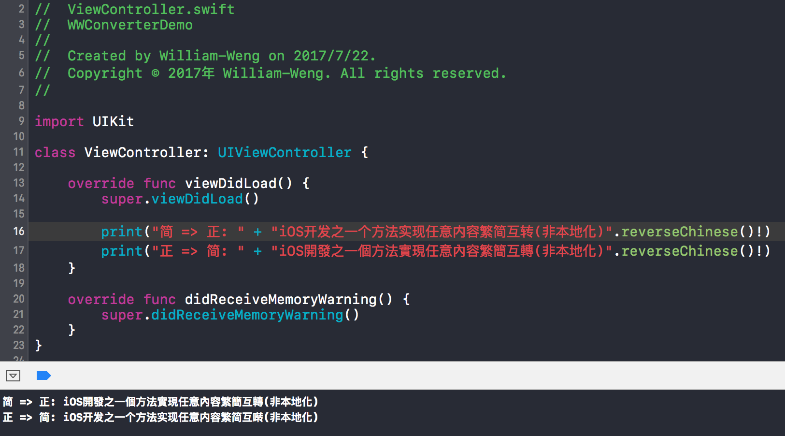

# 中文正簡體互轉

主要是因為要做多國語系檔也是一件麻煩的事情，秉持著工程師的優良個性(誤？)，能不自己寫就不自己寫，能自動就自動的傳統(XD)，就寫了一個小小功能，直接做中文正簡體的互轉…

主要是參考[CGPointZero大的這文章跟字典檔](http://www.jianshu.com/p/861c5f2a4a2a)，自己簡化了一個Swift的版本，希望大家會喜歡…

內容主要就是…把一個一個字拿來查字典 - [正:簡] or [簡:正]